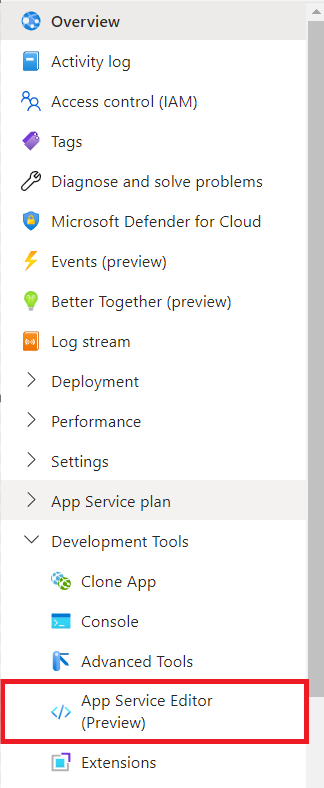
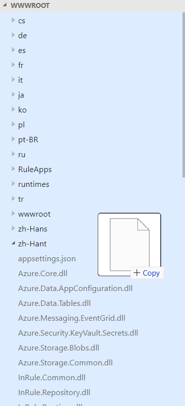

## Uploading a License File
In order for many InRule services function, you must upload the InRuleLicense.xml file provided to you by InRule to the web app. You have two ways to upload a license file, either using the Azure App Service Editor or via FTP.

### Upload Via Azure App Service Editor
In order for many InRule services to properly function, you must upload the InRuleLicense.xml file provided to you by InRule to the web app. The simplest way to upload the license file is via the App Service Editor available on the Azure portal.

First, navigate to the [App Services](https://portal.azure.com/#browse/Microsoft.Web%2Fsites) listing page on the Azure portal and find your newly deployed web app in the list. Click the web app's name to be taken to its overview page. On the left-hand nav-bar, scroll down until you find the App Service Editor option, under the Development Tools header:



On the resulting page, click "Open Editor".

To upload the license file, you will need to drag and drop the InRuleLicense.xml file from your local machine into the top level wwwroot folder. You should be able to see a blue highlight when you are dragging the file into the correct location.



### Upload Via FTP
In order for Catalog Service to properly function, a valid license file must be uploaded to the web app. The simplest way to upload the license file is via FTP.

First, retrieve the FTP deployment profile (url and credentials) with the [az webapp deployment list-publishing-profiles](https://docs.microsoft.com/en-us/cli/azure/webapp/deployment#az-webapp-deployment-list-publishing-profiles) command and put the values into a variable:
```powershell
# Example: az webapp deployment list-publishing-profiles --name contoso-catalog-prod-wa --resource-group inrule-prod-rg --query "[?contains(publishMethod, 'FTP')].{publishUrl:publishUrl,userName:userName,userPWD:userPWD}[0]" | ConvertFrom-Json -OutVariable creds | Out-Null
az webapp deployment list-publishing-profiles --name WEB_APP_NAME --resource-group RESOURCE_GROUP_NAME --query "[?contains(publishMethod, 'FTP')].{publishUrl:publishUrl,userName:userName,userPWD:userPWD}[0]" | ConvertFrom-Json -OutVariable creds | Out-Null
```

Then, upload the license file using those retrieved values:
```powershell
# Example: $client = New-Object System.Net.WebClient;$client.Credentials = New-Object System.Net.NetworkCredential($creds.userName,$creds.userPWD);$uri = New-Object System.Uri($creds.publishUrl + "/InRuleLicense.xml");$client.UploadFile($uri, "$pwd\InRuleLicense.xml");
$client = New-Object System.Net.WebClient;$client.Credentials = New-Object System.Net.NetworkCredential($creds.userName,$creds.userPWD);$uri = New-Object System.Uri($creds.publishUrl + "/InRuleLicense.xml");$client.UploadFile($uri, "LICENSE_FILE_ABSOLUTE_PATH")
```