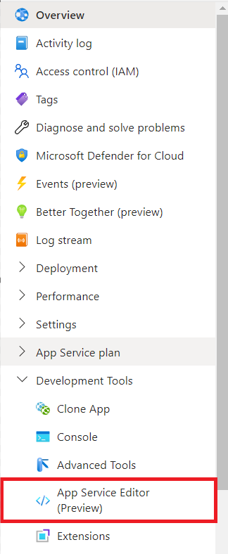
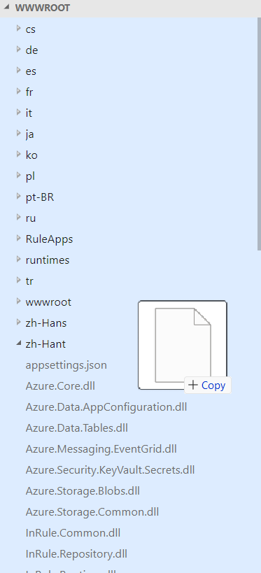

## Configuring a License
In order for many InRule services to function, you must provide the InRuleLicense.xml file provided to you by InRule. You can upload the license file to the web app or use an environment variable.

### Upload Via Azure App Service Editor
The simplest way to upload the license file is via the App Service Editor available on the Azure portal.

First, navigate to the [App Services](https://portal.azure.com/#browse/Microsoft.Web%2Fsites) listing page on the Azure portal and find your newly deployed web app in the list. Click the web app's name to be taken to its overview page. On the left-hand nav-bar, scroll down until you find the App Service Editor option, under the Development Tools header:



On the resulting page, click "Open Editor".

To upload the license file, you will need to drag and drop the InRuleLicense.xml file from your local machine into the top level wwwroot folder. You should be able to see a blue highlight when you are dragging the file into the correct location.



### Upload Via FTP

To upload via FTP, first retrieve the FTP deployment profile (url and credentials) with the [az webapp deployment list-publishing-profiles](https://docs.microsoft.com/en-us/cli/azure/webapp/deployment#az-webapp-deployment-list-publishing-profiles) command and put the values into a variable:
```powershell
# Example: az webapp deployment list-publishing-profiles --name contoso-catalog-prod-wa --resource-group inrule-prod-rg --query "[?contains(publishMethod, 'FTP')].{publishUrl:publishUrl,userName:userName,userPWD:userPWD}[0]" | ConvertFrom-Json -OutVariable creds | Out-Null
az webapp deployment list-publishing-profiles --name WEB_APP_NAME --resource-group RESOURCE_GROUP_NAME --query "[?contains(publishMethod, 'FTP')].{publishUrl:publishUrl,userName:userName,userPWD:userPWD}[0]" | ConvertFrom-Json -OutVariable creds | Out-Null
```

Then, upload the license file using those retrieved values:
```powershell
# Example: $client = New-Object System.Net.WebClient;$client.Credentials = New-Object System.Net.NetworkCredential($creds.userName,$creds.userPWD);$uri = New-Object System.Uri($creds.publishUrl + "/InRuleLicense.xml");$client.UploadFile($uri, "$pwd\InRuleLicense.xml");
$client = New-Object System.Net.WebClient;$client.Credentials = New-Object System.Net.NetworkCredential($creds.userName,$creds.userPWD);$uri = New-Object System.Uri($creds.publishUrl + "/InRuleLicense.xml");$client.UploadFile($uri, "LICENSE_FILE_ABSOLUTE_PATH")
```

### Using an Environment Variable (Optional)

The InRule SDK also supports reading a license from an environment variable. This allows you to configure the license during ARM template deployment without requiring a separate file upload step.

First, use the provided PowerShell script to convert the license file to a data URI format:

```powershell
.\Convert-LicenseToDataUri.ps1 -LicenseFilePath "C:\path\to\InRuleLicense.xml"
```

The script will output a data URI in the format:
```
data:application/xml;base64,<base64-encoded-license>
```

When deploying via ARM templates, provide the data URI as the value for the license parameter:

| Service | Parameter Name |
| ------- | -------------- |
| Catalog Service | `catalogLicenseKey` |
| Decision Service | `executionLicenseKey` |
| Dynamics API | `executionLicenseKey` |
| Salesforce API | `executionLicenseKey` |

Example in the parameters file:
```json
{
  "catalogLicenseKey": {
    "value": "<your-data-uri-here>"
  }
}
```

To set the environment variable after deployment, navigate to the App Service in the Azure portal, go to **Settings > Environment variables**, find the `inrule__license` setting, and paste the data URI output from the script as its value.
